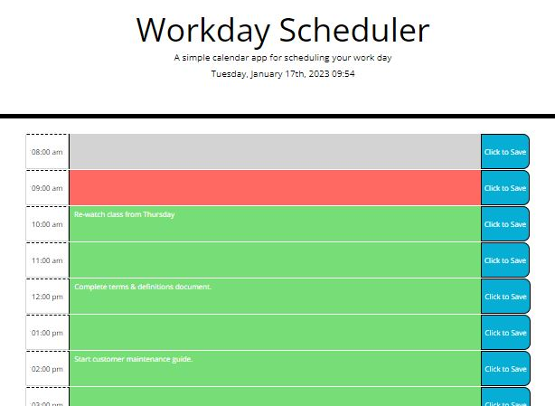

# Workday Scheduler
Module 5 Challenge: Third-Party APIs

## Live Link
https://blakerichardburns.github.io/workday-scheduler/

## Repository Link
https://github.com/blakerichardburns/workday-scheduler

## Description
Code refactor to add interactive functionality to professional day planner utilizating Third Party APIs.

  ## Table of Contents
  * [Installation Instructions](#installation-instructions)
  * [Usage Information](#usage-information)
  * [Questions](#questions)

  ## Installation Instructions
  N/A

  ## Usage Information
  N/A
  
  ## Questions
  For any inquiries, spam by inbox here: blakerichardburns@gmail.com
  To peruse more of my portfolio, check this out: [blakerichardburns](https://github.com/blakerichardburns)